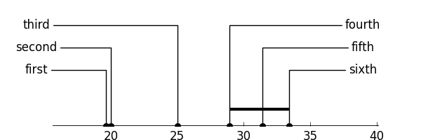

Critical difference
=======

Draws a critical difference graph, which is used to display  the differences in methods'
performance. This is inspired by the plots used in:

`Janez Demsar, Statistical Comparisons of Classifiers over Multiple Data Sets, 7(Jan):1--30, 2006. `

The performance of several methods is marked on an axis. Methods are connected with
 a line if their performance is not significantly different. Note this program does
 provide any statistical tests. Instead, the user writes a function that returns a
 list of all pairs of methods that are not significantly different.

Demo
=======

First we define a bunch of method names and their respective scores.
```python
names = ['first', 'second', 'third', 'fourth', 'fifth', 'sixth']
scores = sorted([31.43, 20.00, 28.93, 19.64, 25, 33.4]) # note the call to sorted

```
We then write a function that takes the scores and returns the indices of methods
that are not different
```
def my_get_lines(*args):
    return [(3, 4), (4, 5), (3, 5)]
```
This program performs little to no validation of the inputs, so it's your
responsibility to ensure that each tuple in the returned list is be sorted and
that no duplicate are should be contained in the list. Examples:
 - `[(0, 1), (3, 4), (4, 5)]` is correct
 - `[(0, 1), (3, 4), (4, 5), (3,4)]` contains a duplicate
 - `[(4, 3)]` contains a non-sorted tuple

**Note:** the indices returned by this callable should refer to positions in `scores`
after it is sorted in increasing order. It is to avoid confusion `graph_ranks`
raises if `scores` is not sorted

We can then plot the desired diagram and save it to disk:

```python
from critical_difference.plot import do_plot, print_figure

fig = do_plot(scores, my_get_lines, names)
print_figure(fig, "test.png", format='png')

```




Note that since methods 3, 4 and 5 are all statistically indistinguishable, the code
draws a single line connecting all three of them to improve legibility. The vertical spacing
between lines can be controlled- see function docstring.

Notes
====

Version 1 was based on code found in [Orange](https://bitbucket.org/biolab/orange/src/a4303110189426d004156ce053ddb35a410e428a/Orange/evaluation/scoring.py).
This is version 2.0, which was re-written from scratch and relies more healivy on `matplotlib`.
It has been tested on Python 2.7 and 3.3. All code is distributed under the terms of
 the GNU General Public License Version 3.
